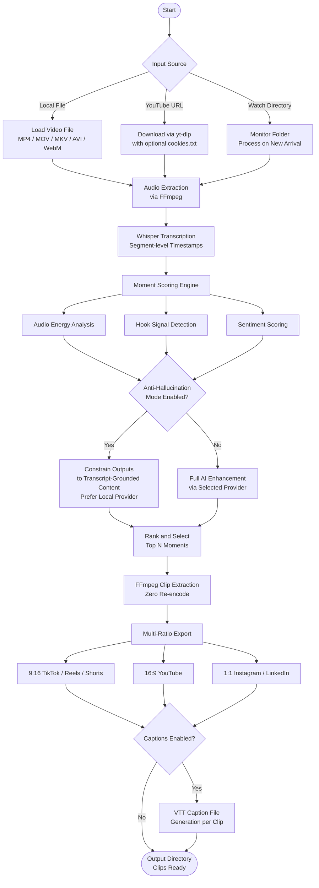
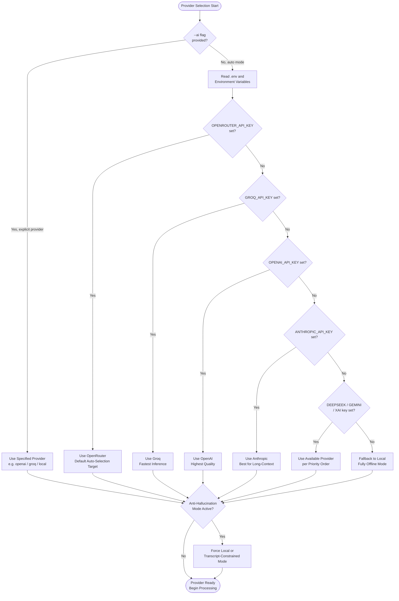

# Clipify

**AI-Powered Viral Clip Generator**

[](https://github.com/princekjha-dev/Clipify/actions/workflows/ci.yml)
[](.github/workflows/ci.yml)
[](https://github.com/princekjha-dev/Clipify/releases)
[](https://www.python.org/downloads/)
[](LICENSE)
[](CONTRIBUTING.md)
[](https://github.com/princekjha-dev/Clipify/stargazers)

---

Clipify transforms long-form video into short-form, platform-ready clips using AI transcription, viral-moment detection, and multi-format export — in a single command. Built for content teams and creators who need fast, repeatable, high-quality clip production without manual trimming.

```bash
python clipify.py --video sample.mp4 --clips 5 --output ./clips
```

## Table of Contents

- [Why Clipify](#why-clipify)
- [What is New in v1.0.1](#what-is-new-in-v101)
- [Quick Start](#quick-start)
- [Overview](#overview)
- [Pipeline Flowchart](#pipeline-flowchart)
- [Features](#features)
- [Performance](#performance)
- [Requirements](#requirements)
- [Installation](#installation)
- [Usage](#usage)
- [AI Providers](#ai-providers)
- [Provider Selection Flow](#provider-selection-flow)
- [Anti-Hallucination Mode](#anti-hallucination-mode)
- [CLI Reference](#cli-reference)
- [Project Structure](#project-structure)
- [Documentation](#documentation)
- [Contributing](#contributing)
- [License](#license)

---

## Why Clipify

Most clip generation workflows require manual review, repeated exports, and platform-specific reformatting. Clipify removes all of that friction:

- **Built for speed.** Process a full-length video and receive scored, formatted clips in a single command.
- **AI-guided selection.** Viral-moment detection uses audio energy analysis, transcript signals, and configurable scoring — not guesswork.
- **Privacy-first by design.** Run entirely offline with `--ai local`, or choose from nine cloud providers depending on your needs.
- **Open source.** No vendor lock-in. Extend any module or swap any provider through a clean, documented interface.

---

## What is New in v1.0.1

- `--ai` flag for explicit provider selection across nine supported backends
- `--anti-hallucination` safe mode that constrains AI outputs to transcript-grounded content
- Local execution support via `--ai local` with zero external dependencies
- New documentation: `ENHANCEMENT.md` and `ANTI_HALLUCINATION_GUIDELINES.md`
- Corrected CLI examples and removed stale references in all documentation
- Improved error handling across transcription, download, and format stages

---

## Quick Start

**1. Clone and install**

```bash
git clone https://github.com/princekjha-dev/Clipify.git
cd Clipify
chmod +x setup.sh && ./setup.sh        # macOS / Linux
# Windows: .\setup.bat
```

**2. Add your AI key** *(optional — skip for fully local mode)*

```bash
cp .env.example .env
# Open .env and set your preferred provider key
```

**3. Run**

```bash
# Local video
python clipify.py --video my_podcast.mp4 --clips 10 --output ./clips

# YouTube URL
python clipify.py --url "https://www.youtube.com/watch?v=VIDEO_ID" --clips 5 --output ./clips

# Fully offline — no API key required
python clipify.py --video my_podcast.mp4 --ai local
```

That's it. Clips land in `./clips` with captions and multi-ratio exports ready for every platform.

---

## Overview

Clipify handles the full clip production pipeline end-to-end:

| Stage | What Happens |
|---|---|
| **Input** | Local file or YouTube URL download |
| **Transcription** | Whisper-based audio-to-text with segment-level timestamps |
| **Moment Detection** | Energy, sentiment, and hook signal scoring |
| **Clip Extraction** | FFmpeg-based zero-re-encode cut |
| **Formatting** | Multi-ratio export for every target platform |
| **Captions** | VTT caption file generation per clip |

**Supported input formats:** `MP4` · `MOV` · `MKV` · `AVI` · `WebM`

**Supported output ratios:** `9:16` (TikTok, Reels, Shorts) · `16:9` (YouTube) · `1:1` (Instagram, LinkedIn)

---

## Pipeline Flowchart

End-to-end processing from input to exported clips.



---

## Features

**Video Processing**

- Process local video files or download directly from YouTube
- Watch a folder continuously and process new videos as they arrive
- Cookies-based authentication for restricted or age-gated YouTube videos

**AI and Transcription**

- Whisper-based transcription with segment-level timestamps
- Nine supported AI providers with automatic fallback chain
- Anti-hallucination mode for factual, transcript-grounded outputs

**Clip Intelligence**

- Viral moment scoring using audio energy, text signals, and hook detection
- Configurable clip count, minimum and maximum clip length
- Provider-level moment filtering and re-scoring where supported

**Export**

- Platform-ready multi-ratio export in a single pass
- Three quality levels: `low`, `medium`, `high`
- Per-clip VTT caption file generation
- Zero-re-encode extraction for maximum speed and quality preservation

---

## Performance

Benchmarked on a MacBook Pro M2 (local mode) and a standard cloud VM (cloud providers):

| Input Length | Clips Requested | Provider | Processing Time |
|---|---|---|---|
| 10 min video | 5 clips | `local` | ~45 sec |
| 30 min podcast | 10 clips | `groq` | ~90 sec |
| 60 min interview | 15 clips | `openai` | ~3 min |
| 120 min webinar | 20 clips | `openrouter` | ~5 min |

> Times include transcription, scoring, clip extraction, and multi-ratio export. Network speed affects YouTube download times.

---

## Requirements

| Requirement | Minimum Version |
|---|---|
| Python | 3.8 |
| FFmpeg | Any recent stable release |
| AI Provider Key | Optional — required only for cloud providers |

---

## Installation

### Automated Setup

**macOS and Linux**

```bash
chmod +x setup.sh
./setup.sh
```

**Windows (PowerShell)**

```powershell
.\setup.bat
```

Or run manually from an elevated PowerShell session:

```powershell
python -m venv .venv
.\.venv\Scripts\Activate.ps1
python -m pip install --upgrade pip
pip install -r requirements.txt
```

**Windows with Chocolatey**

```powershell
choco install python ffmpeg -y
```

### Manual Setup

```bash
git clone https://github.com/princekjha-dev/Clipify.git
cd Clipify
python3 -m venv .venv
source .venv/bin/activate        # Windows: .\.venv\Scripts\Activate.ps1
pip install --upgrade pip
pip install -r requirements.txt
```

### Installing FFmpeg

**Ubuntu / Debian**

```bash
sudo apt update && sudo apt install ffmpeg -y
```

**macOS**

```bash
brew install ffmpeg
```

**Windows**

Install via Chocolatey (`choco install ffmpeg -y`) or download a prebuilt binary from [ffmpeg.org](https://ffmpeg.org/download.html) and add it to `PATH`.

---

## Usage

### Process a local video

```bash
python clipify.py --video sample.mp4 --clips 5 --output ./clips
```

### Process a YouTube video

```bash
python clipify.py --url "https://www.youtube.com/watch?v=VIDEO_ID" --clips 10 --output ./clips
```

### Watch a folder for new videos

```bash
python clipify.py --watch ./incoming --output ./clips
```

### Select an AI provider

```bash
python clipify.py --video sample.mp4 --ai openai
python clipify.py --video sample.mp4 --ai groq
python clipify.py --video sample.mp4 --ai local     # fully offline
```

### Enable anti-hallucination mode

```bash
python clipify.py --video sample.mp4 --anti-hallucination
```

### Export specific aspect ratios

```bash
python clipify.py --video sample.mp4 --formats 9:16 1:1
```

### Set output quality

```bash
python clipify.py --video sample.mp4 --quality high
```

### Disable captions

```bash
python clipify.py --video sample.mp4 --no-captions
```

### Authenticate with YouTube cookies

```bash
python get_youtube_cookies.py
python clipify.py --url "https://www.youtube.com/watch?v=VIDEO_ID" --cookies cookies.txt
```

---

## AI Providers

Clipify supports the following providers. Select one with `--ai` or set `AI_PROVIDER` in your `.env` file.

| Provider | Key Variable | Best For |
|---|---|---|
| `openrouter` | `OPENROUTER_API_KEY` | Default auto-selection target; broadest model access |
| `groq` | `GROQ_API_KEY` | Fastest inference — recommended for high-volume use |
| `deepseek` | `DEEPSEEK_API_KEY` | Strong structured output and JSON responses |
| `openai` | `OPENAI_API_KEY` | Highest quality general-purpose scoring |
| `anthropic` | `ANTHROPIC_API_KEY` | Best for long-context transcripts |
| `gemini` | `GEMINI_API_KEY` | Google multimodal; strong on spoken content |
| `xai` | `XAI_API_KEY` | Grok-based inference |
| `local` | None required | Fully offline — no API key, no network |
| `auto` | Varies | Evaluates available keys and selects the best match |

### Setup

1. Copy `.env.example` to `.env`
2. Add your key for the provider you intend to use
3. Run with `--ai PROVIDER` or omit the flag to let `auto` selection choose

---

## Provider Selection Flow

When `--ai auto` is used or no provider is specified, Clipify evaluates available keys and selects the best match automatically.



---

## Anti-Hallucination Mode

Enable with `--anti-hallucination` or by setting `ANTI_HALLUCINATION=true` in your `.env` file.

When active, Clipify constrains AI outputs to transcript-grounded content, avoids speculative scoring, and prefers local processing when no explicit provider is set.

**Recommended for:**
- News clips, product demos, or compliance-sensitive content
- Environments where accuracy is more important than creativity
- Any workflow where generated descriptions will be published without manual review

See [ANTI_HALLUCINATION_GUIDELINES.md](ANTI_HALLUCINATION_GUIDELINES.md) for the full checklist and provider guidance.

---

## CLI Reference

```text
Input (one required):
  --url URL              YouTube URL to download and process
  --video VIDEO          Path to a local video file
  --watch DIR            Watch a directory for new videos

Output:
  -o, --output DIR       Output directory (default: output)
  --clips N              Number of clips to extract (default: 10)
  --formats FORMATS      Space-separated aspect ratios: 9:16 16:9 1:1
  --quality QUALITY      Output quality: low | medium | high (default: high)

AI:
  --ai PROVIDER          Provider: openrouter | groq | deepseek | openai |
                         anthropic | gemini | xai | local | auto
  --anti-hallucination   Constrain AI to transcript-grounded outputs

Captions:
  --captions             Generate captions for clips (enabled by default)
  --no-captions          Skip caption generation

Authentication:
  --cookies FILE         Path to cookies.txt for YouTube authentication

Logging:
  --verbose              Enable detailed logging output
```

---

## Project Structure

```text
clipify/
├── ai/                         # AI provider implementations
│   ├── base_provider.py        # Abstract provider interface
│   ├── provider_selector.py    # Auto-selection logic
│   ├── provider_manager.py     # Runtime provider management
│   └── *_provider.py           # One file per provider
├── alignment/                  # Word-level timestamp alignment
├── audio_analysis/             # Audio energy and signal detection
├── captions/                   # VTT caption generation
├── core/                       # Core pipeline: download, transcribe, clip, format
├── moments/                    # Viral moment extraction and scoring
├── text_signals/               # Hook and sentiment analysis
├── utils/                      # Config, logger, error classes
├── src/
│   ├── demo.mp4                # Demo video
│   └── logo.png                # Project logo
├── clipify.py                  # CLI entry point
├── get_youtube_cookies.py      # Cookie extraction helper
├── requirements.txt
├── setup.py
├── setup.sh                    # macOS / Linux automated setup
├── setup.bat                   # Windows automated setup
├── .env.example
├── ANTI_HALLUCINATION_GUIDELINES.md
├── CONTRIBUTING.md
├── CODE_OF_CONDUCT.md
├── ENHANCEMENT.md
├── SECURITY.md
└── LICENSE
```

---

## Documentation

| File | Purpose |
|---|---|
| [ENHANCEMENT.md](ENHANCEMENT.md) | Upgrade guide for v1.0.1 |
| [ANTI_HALLUCINATION_GUIDELINES.md](ANTI_HALLUCINATION_GUIDELINES.md) | Anti-hallucination checklist and provider guidance |
| [CONTRIBUTING.md](CONTRIBUTING.md) | Development setup and contribution workflow |
| [CODE_OF_CONDUCT.md](CODE_OF_CONDUCT.md) | Community standards |
| [SECURITY.md](SECURITY.md) | Vulnerability reporting and security policy |

---

## Contributing

Please read [CONTRIBUTING.md](CONTRIBUTING.md) before submitting a pull request.

```bash
git checkout -b feature/your-feature-name
pytest -q
black .
git commit -m "feat: describe your change"
git push origin feature/your-feature-name
```

All PRs require passing tests and Black-formatted code. See [CODE_OF_CONDUCT.md](CODE_OF_CONDUCT.md) for community standards.

---

## License

MIT License. See [LICENSE](LICENSE) for the full terms.

---

If Clipify saves you time, consider starring the repository — it helps other creators find it.

⭐ [github.com/princekjha-dev/Clipify](https://github.com/princekjha-dev/Clipify)
