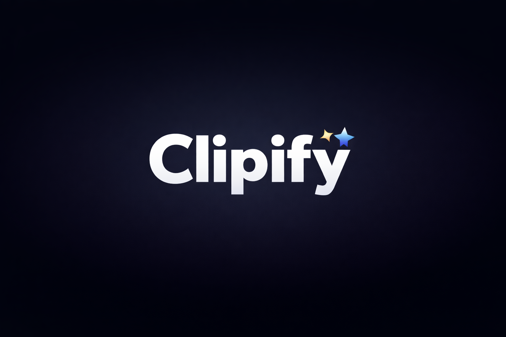

# Clipify — AI-Powered Viral Clip Generator



> **Automatically extract viral moments from any video and generate social-ready clips in multiple aspect ratios — powered by 13+ AI providers.**

---

## Table of Contents

- [Features](#features)
- [System Requirements](#system-requirements)
- [Quick Start](#quick-start)
- [Manual Installation](#manual-installation)
- [Usage](#usage)
- [Advanced Options](#advanced-options)
- [AI Providers](#ai-providers)
- [Project Structure](#project-structure)
- [Configuration Reference](#configuration-reference)
- [Troubleshooting](#troubleshooting)
- [FAQ](#faq)
- [Development Guide](#development-guide)
- [Contributing](#contributing)
- [Changelog](#changelog)
- [License](#license)

---

## Features

| Feature | Description |
|---------|-------------|
| 🎬 **YouTube Download** | Download any public video with optional cookie-based authentication |
| 📝 **Auto Transcription** | Speech-to-text via OpenAI Whisper (cloud) or faster-whisper (local) |
| 🎯 **Viral Moment Detection** | AI ranks moments by engagement potential, hooks, and pacing |
| ✂️ **Clip Extraction** | Stream-copy based extraction — no re-encoding, extremely fast |
| 🎨 **Multi-Format Output** | Export in 9:16 (TikTok/Reels), 16:9 (YouTube), and 1:1 (Instagram) |
| 📊 **Moment Scoring** | Weighted scoring across energy, silence, NLP hooks, and sentiment |
| 💬 **Auto Captions** | Word-aligned captions burned into clips for accessibility |
| 🔌 **13+ AI Providers** | Groq, OpenAI, Claude, Gemini, Mistral, Cohere, Together, and more |
| 🔒 **Local Mode** | 100% private processing via Ollama — no data leaves your machine |

---

## System Requirements

| Component | Minimum | Recommended |
|-----------|---------|-------------|
| Python | 3.8 | 3.11+ |
| RAM | 4 GB | 8 GB+ |
| Disk Space | 2 GB free | 10 GB+ free |
| FFmpeg | Required | Latest stable |
| OS | Windows / macOS / Linux | Any |
| GPU | Optional | CUDA-capable (for faster Whisper) |

---

## Quick Start

### ⚡ Automated Setup (Recommended)

**Windows:**
```batch
setup.bat
```

**macOS / Linux:**
```bash
chmod +x setup.sh && ./setup.sh
```

The setup script handles virtual environment creation, dependency installation, and FFmpeg detection automatically.

---

## Manual Installation

### Step 1 — Clone the Repository
```bash
git clone https://github.com/princekjha-dev/Clipify.git
cd Clipify-main
```

### Step 2 — Create a Virtual Environment

**Windows (PowerShell):**
```powershell
python -m venv .venv
.venv\Scripts\Activate.ps1

# If Activate.ps1 is blocked by execution policy:
Set-ExecutionPolicy -ExecutionPolicy RemoteSigned -Scope CurrentUser
.venv\Scripts\Activate.ps1
```

**macOS / Linux:**
```bash
python3 -m venv .venv
source .venv/bin/activate
```

### Step 3 — Install Python Dependencies
```bash
pip install -r requirements.txt
```

### Step 4 — Install FFmpeg

FFmpeg is required for all video processing. Choose the method that fits your system:

**Windows — No Admin Required (PowerShell):**
```powershell
$url = "https://github.com/BtbN/FFmpeg-Builds/releases/download/latest/ffmpeg-master-latest-win64-gpl.zip"
Invoke-WebRequest -Uri $url -OutFile "$env:TEMP\ffmpeg.zip"
Expand-Archive -Path "$env:TEMP\ffmpeg.zip" -DestinationPath C:\ffmpeg -Force
# Add to PATH for this session:
$env:Path += ";C:\ffmpeg"
ffmpeg -version
```

**Windows — With Chocolatey (Admin Required):**
```bash
choco install ffmpeg -y
```

**macOS:**
```bash
brew install ffmpeg
```

**Linux (Ubuntu / Debian):**
```bash
sudo apt update && sudo apt install ffmpeg -y
```

**Verify installation:**
```bash
ffmpeg -version
```

### Step 5 — Configure API Keys

Copy the example environment file and fill in your API key(s):
```bash
cp .env.example .env
# Open .env in your editor and add at least one provider key
```

You only need **one** API key to get started. See [AI Providers](#ai-providers) to choose the best fit.

Alternatively, set keys directly in your shell:
```bash
# macOS / Linux
export GROQ_API_KEY="gsk_..."

# Windows PowerShell
$env:GROQ_API_KEY = "gsk_..."
```

### Step 6 — (Optional) YouTube Authentication

Only required for age-restricted or login-gated videos:
```bash
python get_youtube_cookies.py
```
This opens a browser, asks you to log into YouTube, and saves a `cookies.txt` file automatically.

---

## Usage

### Process a Local Video
```bash
python clipify.py --video sample.mp4 --clips 5 --output my_clips
```

### Download and Process from YouTube
```bash
python clipify.py \
  --url "https://www.youtube.com/watch?v=DXVHmGoCTco" \
  --clips 10 \
  --quality high \
  --output clips
```

### Expected Output
```
✅ Configuration validated
ℹ️  📥 Downloading video...
ℹ️  📝 Transcribing video...
ℹ️  🎯 Detecting viral moments...
ℹ️  ✂️  Extracting clips...
ℹ️  💬 Adding captions...
✅ Done!
   Moments detected : 12
   Clips generated  : 10
   Output directory : clips/
```

---

## Advanced Options

### Full CLI Reference

```
--url URL              YouTube video URL to download and process
--video VIDEO          Path to a local video file
-o, --output DIR       Output directory (default: output)
--clips N              Number of clips to extract, 1–100 (default: 10)
--formats FORMATS      Space-separated aspect ratios: 9:16 16:9 1:1 (default: 9:16 16:9)
--quality QUALITY      Output quality: low | medium | high (default: high)
--ai PROVIDER          AI provider: groq | openai | anthropic | gemini | local | ...
--captions             Burn captions into clips (default: enabled)
--no-captions          Skip caption generation for faster processing
--cookies FILE         Path to cookies.txt for YouTube authentication
--verbose              Enable detailed logging output
```

### Practical Examples

```bash
# All formats + cookies for a private video
python clipify.py --url "https://youtube.com/watch?v=..." \
  --clips 20 --quality high \
  --formats 9:16 16:9 1:1 \
  --cookies cookies.txt

# Fast local processing (no captions, low quality)
python clipify.py --video podcast.mp4 --clips 5 --quality low --no-captions

# Use a specific AI provider
python clipify.py --video talk.mp4 --ai anthropic --clips 10

# Verbose output for debugging
python clipify.py --video video.mp4 --verbose
```

---

## AI Providers

Clipify supports 13 AI providers through a modular architecture. Set up **at least one** to get started.

### Provider Comparison

| Provider | Speed | Cost | Quality | Context | Best For |
|----------|-------|------|---------|---------|----------|
| **Groq** | ⚡⚡⚡ | Free tier | ⭐⭐⭐ | 32K | Real-time, speed-critical |
| **OpenAI** | ⚡⚡ | Paid | ⭐⭐⭐⭐⭐ | 128K | General purpose, highest quality |
| **Anthropic Claude** | ⚡⚡ | Paid | ⭐⭐⭐⭐⭐ | 200K | Long videos, nuanced reasoning |
| **Google Gemini** | ⚡⚡ | Free tier | ⭐⭐⭐⭐ | 32K | Multimodal, vision tasks |
| **DeepSeek** | ⚡⚡⚡ | Very cheap | ⭐⭐⭐ | 128K | Budget-conscious deployments |
| **OpenRouter** | ⚡⚡ | Free+ | ⭐⭐⭐⭐ | Varies | Model flexibility, 150+ options |
| **Mistral AI** | ⚡⚡ | Free tier | ⭐⭐⭐ | 32K | European data residency |
| **Cohere** | ⚡⚡ | Free tier | ⭐⭐⭐ | 128K | Summarisation, RAG |
| **Together AI** | ⚡⚡ | Very cheap | ⭐⭐⭐ | Varies | Open-source models at scale |
| **Fireworks AI** | ⚡⚡⚡ | Very cheap | ⭐⭐⭐ | Varies | Fastest open-source inference |
| **Perplexity** | ⚡⚡ | Paid | ⭐⭐⭐ | 200K | Web-connected, real-time context |
| **xAI (Grok)** | ⚡⚡ | Paid | ⭐⭐⭐ | 128K | Real-time content, X/Twitter data |
| **Local (Ollama)** | ⚡⚡ | Free | ⭐⭐⭐ | 4K–32K | Full privacy, offline use |

### Setting Up Each Provider

#### Groq — Free, Ultra-Fast
```bash
export GROQ_API_KEY="gsk_..."
# Get key: https://console.groq.com/keys
# Supported models: llama3-8b-8192, mixtral-8x7b-32768, gemma-7b-it
```

#### OpenAI — Highest Quality
```bash
export OPENAI_API_KEY="sk-proj-..."
# Get key: https://platform.openai.com/api-keys
# Supported models: gpt-4o, gpt-4o-mini, gpt-3.5-turbo
```

#### Anthropic Claude — Best for Long Videos
```bash
export ANTHROPIC_API_KEY="sk-ant-..."
# Get key: https://console.anthropic.com/
# Supported models: claude-3-5-sonnet-20241022, claude-3-haiku-20240307
```

#### Google Gemini — Multimodal, Free Tier
```bash
export GEMINI_API_KEY="AIzaSy-..."
# Get key: https://aistudio.google.com/app/apikeys
# Supported models: gemini-1.5-flash, gemini-1.5-pro
```

#### DeepSeek — Cheapest Paid Option
```bash
export DEEPSEEK_API_KEY="sk-..."
# Get key: https://platform.deepseek.com/api_keys
```

#### OpenRouter — 150+ Models via One Key
```bash
export OPENROUTER_API_KEY="sk-or-..."
# Get key: https://openrouter.ai/keys
# Browse free models: https://openrouter.ai/models
```

#### Mistral AI — European, Open-Source
```bash
export MISTRAL_API_KEY="..."
# Get key: https://console.mistral.ai/api-keys
# Supported models: mistral-large-latest, open-mistral-7b
```

#### Cohere — RAG & Summarisation
```bash
export COHERE_API_KEY="..."
# Get key: https://dashboard.cohere.com/api-keys
# Supported models: command-r-plus, command-r
```

#### Together AI — Open-Source at Scale
```bash
export TOGETHER_API_KEY="..."
# Get key: https://api.together.xyz/settings/api-keys
```

#### Fireworks AI — Fastest Open-Source
```bash
export FIREWORKS_API_KEY="fw_..."
# Get key: https://fireworks.ai/account/api-keys
# Free tier: 600K tokens/month
```

#### Perplexity — Web-Connected
```bash
export PERPLEXITY_API_KEY="pplx-..."
# Get key: https://www.perplexity.ai/settings/api
# Supported models: llama-3.1-sonar-large-128k-online
```

#### xAI Grok — Real-Time
```bash
export XAI_API_KEY="xai-..."
# Get key: https://console.x.ai/
# Supported models: grok-2, grok-2-mini
```

#### Local / Ollama — 100% Private, Free
```bash
# Install Ollama: https://ollama.com/download
ollama pull llama3
ollama serve

# Then run Clipify with:
python clipify.py --video video.mp4 --ai local
```

### Switching Providers

**Via environment variable (recommended):**
```bash
export AI_PROVIDER=groq
python clipify.py --video video.mp4
```

**Via CLI flag:**
```bash
python clipify.py --video video.mp4 --ai anthropic
```

**Via config file (`utils/config.py`):**
```python
class Config:
    AI_PROVIDER = "groq"
    AI_MODEL    = "mixtral-8x7b-32768"
```

### Automatic Fallback Chain

If your primary provider fails, Clipify automatically retries with the next available provider:

```
groq → openai → anthropic → openrouter → local
```

To disable fallback, set `DISABLE_FALLBACK=true` in your `.env`.

---

## Project Structure

```
clipify/
├── ai/                        # AI provider integrations
│   ├── base_provider.py       # Abstract base class all providers implement
│   ├── provider_manager.py    # Provider registry and fallback logic
│   ├── openai_provider.py
│   ├── groq_provider.py
│   ├── anthropic_provider.py
│   ├── gemini_provider.py
│   ├── deepseek_provider.py
│   ├── openrouter_provider.py
│   ├── mistral_provider.py
│   ├── cohere_provider.py
│   ├── together_provider.py
│   ├── fireworks_provider.py
│   ├── perplexity_provider.py
│   ├── xai_provider.py
│   └── local_provider.py      # Ollama integration
├── alignment/                 # Word-level caption alignment
├── audio_analysis/            # Energy, silence, and audio feature extraction
├── captions/                  # Caption rendering and styling
├── core/
│   ├── downloader.py          # YouTube / local video ingestion (yt-dlp)
│   ├── transcriber.py         # Whisper transcription (cloud + local)
│   ├── clip_processor.py      # FFmpeg stream-copy clip extraction
│   └── formatter.py           # Multi-aspect-ratio output formatting
├── moments/
│   ├── extractor.py           # Moment candidate detection
│   └── scorer.py              # Virality scoring algorithm
├── text_signals/              # NLP hooks, sentiment, keyword analysis
├── utils/
│   ├── config.py              # Central configuration class
│   └── logger.py              # Logging setup
├── clipify.py                 # Main CLI entry point
├── get_youtube_cookies.py     # Browser-based cookie exporter
├── test_download.py           # Download + auth testing utility
├── requirements.txt
├── .env.example               # Environment variable template
└── setup.sh / setup.bat       # Automated setup scripts
```

---

## Configuration Reference

### Environment Variables (`.env`)

See `.env.example` for the full annotated list. Key variables:

| Variable | Default | Description |
|----------|---------|-------------|
| `OPENAI_API_KEY` | — | OpenAI API key |
| `GROQ_API_KEY` | — | Groq API key |
| `ANTHROPIC_API_KEY` | — | Anthropic API key |
| `GEMINI_API_KEY` | — | Google Gemini API key |
| `FFMPEG_PATH` | auto-detect | Absolute path to ffmpeg binary |
| `WHISPER_MODEL` | `base` | Whisper model size: tiny / base / small / medium / large |
| `WHISPER_BACKEND` | `local` | `local` (faster-whisper) or `openai` (API) |
| `WHISPER_LANGUAGE` | auto | ISO 639-1 language code (e.g. `en`, `es`, `fr`) |
| `DEFAULT_CLIPS` | `10` | Default number of clips to extract |
| `DEFAULT_QUALITY` | `high` | Output quality: low / medium / high |
| `DEFAULT_FORMAT` | `9:16` | Default aspect ratio |
| `MIN_CLIP_LENGTH` | `2.0` | Minimum clip duration in seconds |
| `MAX_CLIP_LENGTH` | `30.0` | Maximum clip duration in seconds |
| `MAX_WORKERS` | `4` | Parallel processing threads |
| `USE_GPU` | `false` | Enable GPU acceleration (requires CUDA) |
| `OUTPUT_DIR` | `./output` | Output clips directory |
| `CACHE_DIR` | `./cache` | Temporary cache directory |

### Code Configuration (`utils/config.py`)

```python
class Config:
    # Clip settings
    DEFAULT_CLIP_COUNT  = 50
    MIN_CLIP_LENGTH     = 25    # seconds
    MAX_CLIP_LENGTH     = 50    # seconds
    TARGET_CLIP_LENGTH  = 35    # seconds

    # Output
    DEFAULT_FORMATS = ["9:16", "16:9"]
    VIDEO_QUALITY   = "high"    # low | medium | high

    # AI provider
    AI_PROVIDER = "groq"
    AI_MODEL    = "mixtral-8x7b-32768"
```

---

## Processing Pipeline

```
Input Video (YouTube URL or local file)
        │
        ▼
┌───────────────┐
│  Downloader   │  ◄── yt-dlp + ffmpeg
└──────┬────────┘
       │
       ▼
┌───────────────┐
│  Transcriber  │  ◄── OpenAI Whisper (cloud) or faster-whisper (local)
└──────┬────────┘
       │
       ▼
┌─────────────────────────────────────────┐
│           Signal Extraction             │
│  ┌─────────────┐  ┌──────────────────┐  │
│  │Audio Energy │  │  NLP / Hooks /   │  │
│  │  Analyzer   │  │ Silence Detector │  │
│  └─────────────┘  └──────────────────┘  │
└───────────────────┬─────────────────────┘
                    │
                    ▼
          ┌─────────────────┐
          │ Moment Scorer   │  ◄── AI provider (Groq / OpenAI / etc.)
          │ (virality rank) │
          └────────┬────────┘
                   │
                   ▼
          ┌─────────────────┐
          │ Clip Extractor  │  ◄── ffmpeg stream-copy (no re-encode)
          └────────┬────────┘
                   │
                   ▼
          ┌─────────────────┐
          │ Multi-Format    │  ◄── 9:16, 16:9, 1:1
          │   Formatter     │
          └────────┬────────┘
                   │
                   ▼
          ┌─────────────────┐
          │ Caption Writer  │  ◄── Word-aligned subtitles (optional)
          └────────┬────────┘
                   │
                   ▼
            Output Clips ✅
```

---

## Troubleshooting

### ❌ FFmpeg Not Found

**Error:** `You have requested merging of multiple formats but ffmpeg is not installed`

1. Verify FFmpeg is installed: `ffmpeg -version`
2. If installed but not found, set the path explicitly in `.env`:
   ```
   FFMPEG_PATH=C:\ffmpeg\bin\ffmpeg.exe
   ```
3. See [Step 4 of Manual Installation](#step-4--install-ffmpeg) for installation instructions.

---

### ❌ YouTube Bot Detection

**Error:** `Sign in to confirm you're not a bot`

```bash
python get_youtube_cookies.py
python clipify.py --url "..." --cookies cookies.txt
```

Cookies expire periodically — re-run `get_youtube_cookies.py` if the issue recurs.

---

### ❌ API Key Not Found

**Error:** `AuthenticationError: API key not found`

Ensure your `.env` file exists and contains the correct key:
```bash
# Check your .env
cat .env | grep API_KEY

# Or export directly
export GROQ_API_KEY="gsk_..."
```

---

### ❌ Module Not Found

**Error:** `ModuleNotFoundError: No module named 'yt_dlp'`

```bash
# Ensure virtual environment is activated
source .venv/bin/activate        # macOS/Linux
.venv\Scripts\Activate.ps1       # Windows

# Reinstall dependencies
pip install -r requirements.txt --force-reinstall
```

---

### ❌ ImportError: cannot import name 'Config'

Fixed in v1.0.1. Update your code:
```bash
git pull origin main
pip install -r requirements.txt
```

---

### ❌ Slow Processing / Timeout

Speed up processing with these flags:
```bash
python clipify.py --video video.mp4 \
  --clips 5 \
  --quality low \
  --no-captions
```

For transcription speed, use a smaller Whisper model in `.env`:
```
WHISPER_MODEL=tiny
```

---

### ❌ Out of Memory

- Reduce `--clips` count
- Use `--quality low`
- Process shorter videos
- Switch to a smaller Whisper model (`tiny` or `base`)
- Close other memory-heavy applications

---

### ✅ Setup Verification Checklist

```bash
# 1. Python version (must be 3.8+)
python --version

# 2. FFmpeg
ffmpeg -version

# 3. Dependencies installed
pip list | grep yt-dlp

# 4. Config loads correctly
python -c "from utils.config import Config; print('Config OK:', Config.DEFAULT_CLIP_COUNT)"

# 5. Download test
python test_download.py --help
```

---

## FAQ

**Q: How long does processing take?**
- 10-minute video with captions: ~2–5 minutes
- 10-minute video without captions: ~1–2 minutes
- Processing time scales with video length, clip count, and Whisper model size.

**Q: Can I use a local video file instead of YouTube?**
Yes — use `--video` instead of `--url`:
```bash
python clipify.py --video path/to/video.mp4
```

**Q: What input formats are supported?**
MP4, MOV, MKV, AVI, WebM. Output aspect ratios: 9:16, 16:9, 1:1, 4:3.

**Q: Do I need a GPU?**
No. GPU acceleration is optional. CPU-only processing takes longer but works fine.

**Q: Do I need API keys?**
No. Use `--ai local` for fully offline processing via Ollama. No API key required.

**Q: Can I customise how moments are scored?**
Yes — edit `moments/scorer.py` to tune the scoring weights for energy, silence, NLP signals, and sentiment.

**Q: How many clips can I extract per video?**
Between 1 and 100. More clips means longer processing time.

**Q: Can I use this commercially?**
Yes, subject to the MIT License terms and YouTube's Terms of Service for downloaded content.

---

## Development Guide

### Setting Up for Development

```bash
git clone https://github.com/princekjha-dev/Clipify.git
cd Clipify-main

python3 -m venv .venv
source .venv/bin/activate

pip install -e .
pip install -r requirements.txt
pip install pytest black pylint mypy
```

### Running Tests

```bash
pytest                          # Run all tests
pytest --cov=.                  # Run with coverage report
pytest test_clipify.py -v       # Run specific file with verbose output
```

### Code Quality

```bash
black .                         # Auto-format code
pylint **/*.py                  # Lint
mypy .                          # Type checking
```

### Adding a New AI Provider

1. **Create the provider file:**
   ```python
   # ai/my_provider.py
   from ai.base_provider import BaseProvider

   class MyProvider(BaseProvider):
       def health_check(self): ...
       def get_available_models(self): ...
       def complete(self, messages, model, **kwargs): ...
       def stream_complete(self, messages, model, **kwargs): ...
       def count_tokens(self, text): ...
       def calculate_cost(self, input_tokens, output_tokens): ...
   ```

2. **Register in the provider manager:**
   ```python
   # ai/provider_manager.py
   manager.register("my_provider", MyProvider)
   ```

3. **Add the API key to `.env.example`:**
   ```bash
   MY_PROVIDER_API_KEY=YOUR_KEY_HERE
   ```

4. **Test it:**
   ```python
   from ai.provider_manager import ProviderManager
   provider = ProviderManager().get_provider("my_provider")
   result = provider.complete([{"role": "user", "content": "Hello"}])
   print(result)
   ```

### Core Module API

```python
# Transcription
from core.transcriber import transcribe_video
transcript = transcribe_video("video.mp4")

# Moment Detection
from moments.extractor import extract_auto_moments
moments = extract_auto_moments(transcript, "video.mp4")

# Clip Extraction
from core.clip_processor import extract_clips
clips = extract_clips(moments, "video.mp4")

# Multi-Format Output
from core.formatter import format_clips_multi_platform
formatted = format_clips_multi_platform(clips, formats=["9:16", "16:9"])
```

---

## Contributing

We welcome all contributions! 🎉

### Before You Start

Please read:
- [CODE_OF_CONDUCT.md](CODE_OF_CONDUCT.md) — Community standards
- [CONTRIBUTING.md](CONTRIBUTING.md) — Full contribution workflow
- [SECURITY.md](SECURITY.md) — Vulnerability reporting

### How to Contribute

```bash
# 1. Fork and clone
git clone https://github.com/YOUR_USERNAME/Clipify.git
cd Clipify-main

# 2. Create a feature branch
git checkout -b feature/your-feature-name

# 3. Make your changes, then test
pytest --cov=.
black .

# 4. Commit with a meaningful message
git commit -m "feat: describe what you added"

# 5. Push and open a PR
git push origin feature/your-feature-name
```

Use the [Bug Report](.github/ISSUE_TEMPLATE/bug_report.md) or [Feature Request](.github/ISSUE_TEMPLATE/feature_request.md) templates when opening issues.

> ⚠️ **Security issues**: Do **not** open public issues for vulnerabilities. Email the maintainer privately — see [SECURITY.md](SECURITY.md).

### Areas for Contribution

- New AI provider integrations
- Improved moment detection algorithms
- Additional output formats
- Batch processing improvements
- Performance optimisations
- Better error messages and UX
- Documentation and examples

---

## Changelog

### v1.0.1 — Latest
- ✅ Added 6 new AI providers: Mistral, Cohere, Together AI, Fireworks AI, Perplexity, xAI Grok
- ✅ Enterprise provider infrastructure with registry and fallback chain
- ✅ Community governance files: CONTRIBUTING.md, CODE_OF_CONDUCT.md, SECURITY.md
- ✅ GitHub issue and PR templates
- ✅ Fixed `Config` class import error
- ✅ Fixed `Logger()` initialisation error

### v1.0.0 — Initial Release
- 🎉 YouTube downloading via yt-dlp
- 🎯 AI-powered viral moment detection
- ✂️ Multi-format clip generation
- 💬 Auto captions
- 🔌 7 AI provider integrations

See [CHANGELOG.md](CHANGELOG.md) for full version history.

---

## Quick Reference

| Task | Command |
|------|---------|
| Create virtual env | `python -m venv .venv` |
| Activate (macOS/Linux) | `source .venv/bin/activate` |
| Activate (Windows) | `.venv\Scripts\Activate.ps1` |
| Install dependencies | `pip install -r requirements.txt` |
| Process local video | `python clipify.py --video video.mp4` |
| Process YouTube video | `python clipify.py --url "https://youtube.com/watch?v=..."` |
| Get YouTube cookies | `python get_youtube_cookies.py` |
| Skip captions (faster) | `--no-captions` |
| Low-quality fast mode | `--quality low --no-captions --clips 5` |
| Custom output folder | `--output my_clips` |
| Verbose logging | `--verbose` |
| List all options | `python clipify.py --help` |

---

## License

MIT License — see [LICENSE](LICENSE) for details.

---

## Support

| Channel | Link |
|---------|------|
| 📖 Documentation | This README |
| 🐛 Bug Reports | [GitHub Issues](https://github.com/princekjha-dev/Clipify/issues) |
| 💡 Feature Requests | [GitHub Discussions](https://github.com/princekjha-dev/Clipify/discussions) |
| 🔒 Security | Email maintainer privately (see SECURITY.md) |

---

**Made with ❤️ by the Clipify Team**

https://github.com/princekjha-dev/Clipify
